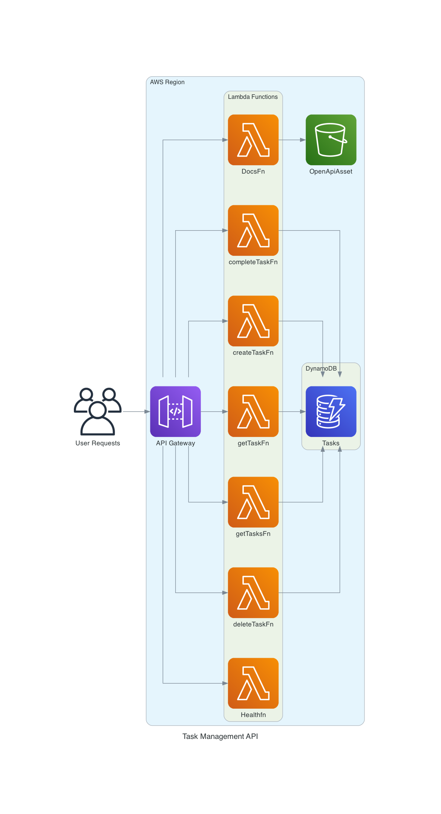

[](https://python-poetry.org/)

# Task Management API

This is a Serverless Application built using AWS CDK (Cloud Development Kit), AWS Lambda, API Gateway, and DynamoDB. The API provides a set of endpoints to manage tasks.

## Architecture


## Features
- Create a new task
- Get details of a task
- Get all tasks
- Update a task
- Mark a task as complete
- Delete a task
- Health check endpoint
- OpenAPI Documentation endpoint

## AWS Services used
- AWS CDK: Infrastructure as Code (IaC) to define and provision cloud infrastructure.
- AWS Lambda: Serverless compute service to execute the business logic.
- AWS API Gateway: Fully managed service to create, publish, maintain, monitor, and secure REST APIs.
- AWS DynamoDB: Key-value and document database that delivers single-digit millisecond performance at any scale.

## Getting Started

### Prerequisites
- AWS Account
- AWS CLI (version 2) installed and configured
- Node.js (version 16.0.0 or later)
- TypeScript (version 5.1.6 or later)
- AWS CDK (version 2.80.0 or later)
- Python (version 3.10 or later)

### Installation

1. Clone the repository
2. Install the necessary packages: using `npm install`
3. Bootstrap the CDK app: `npm run bootstrap`
4. Deploy the app: `npm run deploy`


### Usage

After deploying, the API Gateway will provide an URL to access the REST API endpoints.

- `POST /tasks`: create a new task
```json
REQUEST BODY:
{
  "taskName": "Clean the house",
  "dueDate": "2023-08-15",
  "description": "Need to clean the house before guests arrive."
}

RESPONSE:
{
"id": "fa7a79f2-fd97-4397-8719-42e75b9dffb6",
"taskName": "Clean the house",
"dueDate": "2023-08-15",
"description": "Need to clean the house before guests arrive.",
"status": "INCOMPLETE"
}
```
- `GET /tasks`: get all tasks
- `GET /tasks/{Id}`: get a specific task by Id
- `PUT /tasks/{Id}`: mark a task as complete by Id
- `DELETE /tasks/{Id}`: delete a task by Id
- `GET /docs`: get OpenAPI documentation
- `GET /health`: health check endpoint
```
Only the POST /tasks need a request body the rest are affected by the dynamic path parameter
```
### Cleaning Up
To delete the stacks: `npm run destroy`

## License

This project is licensed under the MIT License - see the [LICENSE.md](link-to-license.md) file for details.

